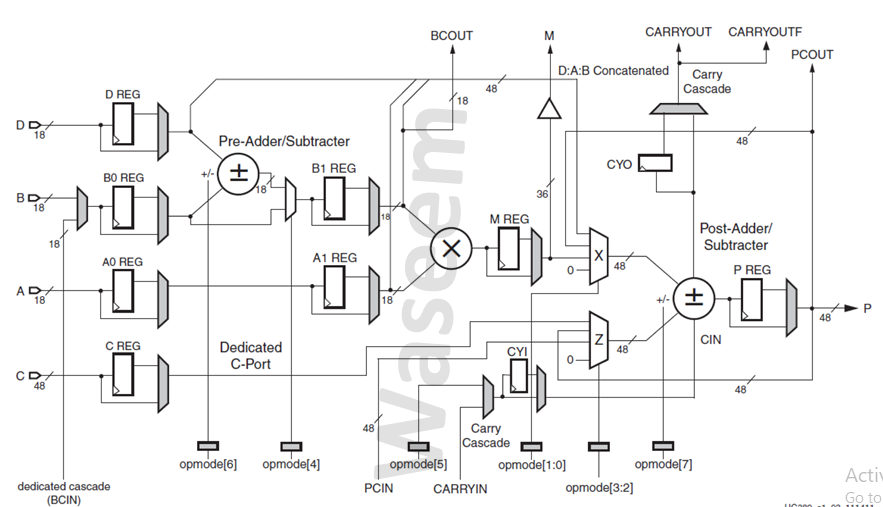

# Spartan6-DSP48A1 

This project implements a **DSP48A1 slice** for Xilinx Spartan-6 FPGAs using **Verilog HDL**, optimized for high-performance digital signal processing tasks such as multiply-accumulate (MAC) operations, filtering, and FFTs.  
The DSP48A1 is a dedicated arithmetic block capable of handling fast multiplication, addition, accumulation, and other DSP-related operations.

---
## Reference
 - This design is based on the DSP48A1 documentation and guidlines from AMD : https://docs.amd.com/v/u/en-US/ug389
---
## Design interface
     


 
## Features
- Parameterized DSP48A1 slice implementation.
- Supports synchronous and asynchronous resets.
- Implements:
  - 18x18 high-speed multiplication  
  - Addition & subtraction  
  - Accumulation with pipeline registers  
  - Flexible input multiplexing (A, B, C, D, OPMODE, Carry)  
  - Cascade and direct input modes for B port  
  - Carry-in/out with configurable source selection  
- Fully synthesizable Verilog HDL.  
- Modular design with reusable submodules.  
- Testbench included for functional verification.  

---

## Project Structure
📁 constraints  📁 do_file  📁 src   📁 tb  📄 DSP48A1_Report.pdf   📄 README.md
---

## Tools
- **QuestaSim** — Simulation  
- **QuestaLint** — Linting  
- **Xilinx Vivado** — Synthesis, Implementation  

---

## Documentation
The full design documentation `DSP48A1_Report.pdf` includes:
- RTL Design  
- Testbench description  
- Simulation results  
- DO file  
- Constraint file  
- RTL Schematic  
- Synthesis report  
- Implementation report  
- Timing analysis  
- Device utilization  
- Linting with 0 errors and warnings  

---

## Design Files
- `spartan6-DSP48A1.v`: Top-level Verilog module for DSP48A1 slice implementation.  
- `spartan6-DSP48A1_tb.v`: Verilog testbench for simulation and verification.  
- `run.do`: Script for automating the simulation process.  

---

## Getting Started
To work with this project, you’ll need a Verilog simulator. **QuestaSim** is recommended.

### 1. Quick Simulation (Recommended)
A preconfigured script `run.do` is provided to automate the simulation.

**Steps:**
1. Ensure your simulator is installed and licensed.  
2. Open a terminal or simulator console.  
3. Navigate to the project directory.  
4. Run:  
   ```tcl
   do run.do
